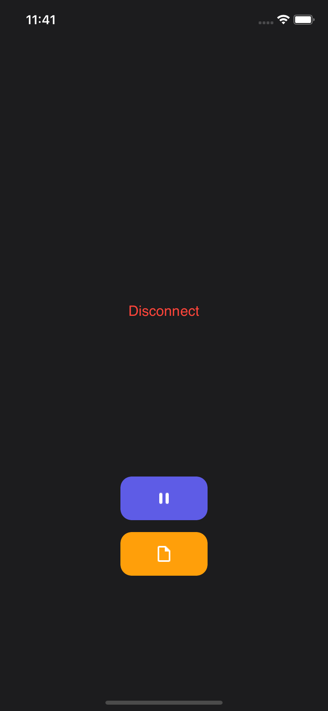

# AirPodsPro Data Record App



The App has the functionality to record AirPods Pro data.

Make sure the AirPods Pro is connected to the phone otherwise the screen will show ```Disconnect```.

After it is connected, the text will show ```Normal``` or ```Warning```.
- ```Normal``` means your neck position is good.
- ```Warning``` means your neck position is bad.

To start recording just click the purple button, and the button will change to Red, to stop recording just click it again.

To see the files you just recorded, click the orange button.
